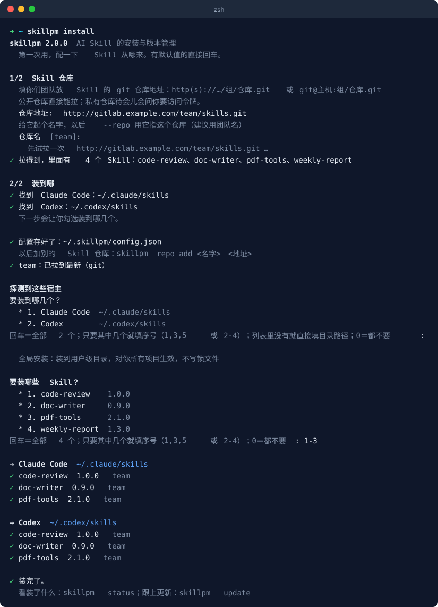
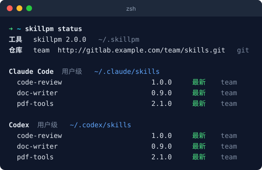
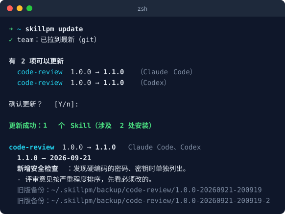
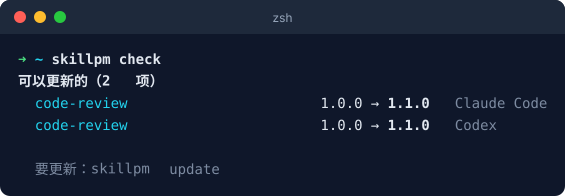
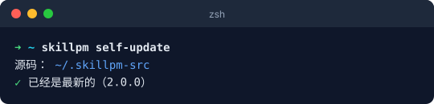
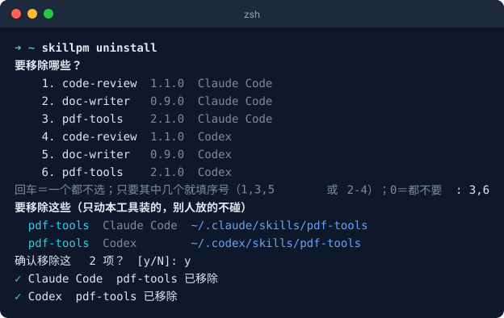
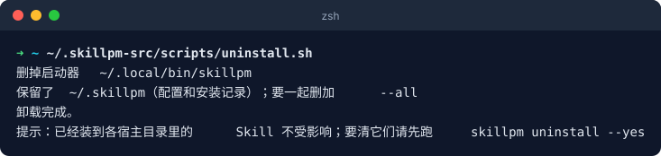
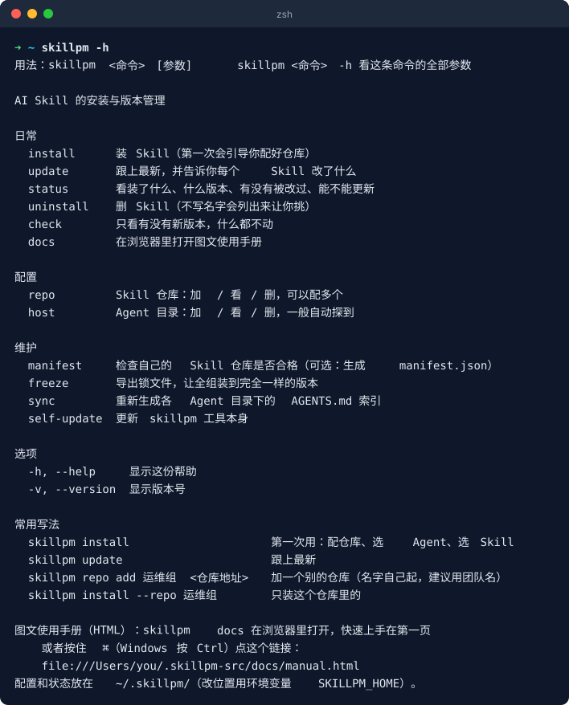

# 快速上手

skillpm 把 AI Skill 一键装到你用的各个 Agent（WorkBuddy、Claude Code、Codex、Cursor……），并跟着仓库更新。
下面按顺序走一遍：**装工具 → 第一次配置 → 看状态 → 更新 → 卸载**。每一步的截图都是真实运行的输出。

## 1. 装工具（只做一次）

**Mac / Linux** 在终端里粘贴：

```bash
git clone https://github.com/suqian-bit/skillpm.git ~/.skillpm-src 2>/dev/null; ~/.skillpm-src/scripts/install.sh
```


**Windows** 在 PowerShell 里粘贴：

```powershell
if (-not (Test-Path $env:USERPROFILE\.skillpm-src)) { git clone https://github.com/suqian-bit/skillpm.git $env:USERPROFILE\.skillpm-src }; Set-ExecutionPolicy -Scope Process Bypass -Force; & "$env:USERPROFILE\.skillpm-src\scripts\install.ps1"
```

装完敲 `skillpm -v` 能看到版本号就行；提示找不到命令的话，新开一个终端。

## 2. 第一次配置 + 装 Skill

```bash
skillpm install
```

第一次会依次问四件事，**只有第一个要填**，后面三个直接回车就行：

| 问什么 | 怎么答 |
|---|---|
| 仓库地址 | **必填**：你们团队放 Skill 的 git 仓库地址，找维护的人要；仓库怎么准备见[接入自己的仓库](接入自己的Skill仓库.md) |
| 仓库名 | 回车 |
| 装到哪几个 Agent | 回车＝本机找到的全装；只要某几个就填序号，比如 `1,3` |
| 装哪些 Skill | 回车＝全装；只要某几个就填序号，比如 `5,7,8` 或 `2-4` |



填的仓库地址会当场试拉一次，拉不到会说原因、让你重填。以后再跑 `skillpm install` 就不问仓库了，只问装到哪、装哪些。

## 3. 看装了什么

```bash
skillpm status
```

每个 Agent 下装了哪些 Skill、什么版本、是不是最新、有没有被人改过：



## 4. 更新

```bash
skillpm update
```

它会先列出哪些有新版本，回车确认后更新，**再把每个 Skill 改了什么念给你**，旧版自动备份：



只想看看有没有新版本、先不动：`skillpm check`



**更新工具本身**（不是 Skill）：`skillpm self-update`。有新版本时会念更新日志，手册有更新也会提醒你：



## 5. 卸载

**删 Skill**：不写名字会列出来让你挑，确认后才删：

```bash
skillpm uninstall
```



**删 skillpm 工具本身**：已经装进 Agent 的 Skill 不受影响；要全清干净就**先删 Skill 再删工具**。

```bash
~/.skillpm-src/scripts/uninstall.sh
```



## 6. 忘了命令

```bash
skillpm -h          # 所有命令，按日常 / 配置 / 维护分好组
skillpm docs        # 在浏览器里打开这份手册
```



任何命令后面加 `-h` 看它的全部参数；写错了会猜你想写什么，并列出常用写法。

---

## 常用命令速查

| 我想 | 命令 |
|---|---|
| 装 / 补装 Skill | `skillpm install` |
| 全装，不问装哪些 | `skillpm install --all` |
| 只装某几个 | `skillpm install code-review pdf-tools` |
| 装到当前项目（只对这个仓库生效） | `skillpm install -p` |
| 看装了什么 | `skillpm status` |
| 更新 / 不问直接更新 | `skillpm update` / `skillpm update --yes` |
| 删某个 Skill | `skillpm uninstall code-review` |
| 加一个别的仓库 | `skillpm repo add <名字> <地址>` |
| 让全组装到完全一样的版本 | `skillpm freeze`，别人 `skillpm install --from <锁文件>` |
| 更新工具本身 | `skillpm self-update` |

## 必须知道的 3 件事

1. **别人的东西不会被覆盖。** 你本地改过的、或者不是本工具装的 Skill，安装和更新都会跳过并告诉你；确实要覆盖加 `--force`（会先备份）。
2. **更新前自动备份。** 旧版在 `~/.skillpm/backup/<Skill名>/<版本>-<时间>/`，想退回直接拷回去。
3. **多个仓库有同名 Skill：** 换来源只在你自己 `install` 时发生，而且会先问你；`update` 永远只跟着装的时候那个仓库。

## 出问题了

| 现象 | 先这样 |
|---|---|
| 说有冲突、跳过了 | 你本地改过那个 Skill，或者它不是本工具装的。`skillpm status` 看是哪个；确认不要本地改动就加 `--force` |
| 仓库拉不下来 | 报错会说原因（要登录、找不到、连不上、端口不对、被代理截走……），照提示改 |
| 找不到 `skillpm` 命令 | 新开一个终端；还不行就重跑第 1 步的安装命令 |
| Agent 里看不到新装的 Skill | 重启一下那个 Agent；`skillpm status` 确认装到的目录对不对 |
| 其他问题、建议 | 填到[GitHub Issues](https://github.com/suqian-bit/skillpm/issues) |
