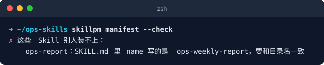
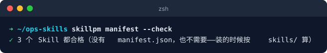
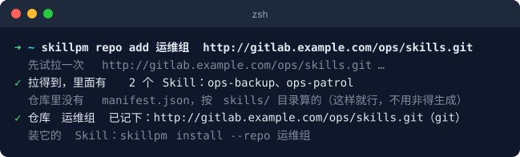
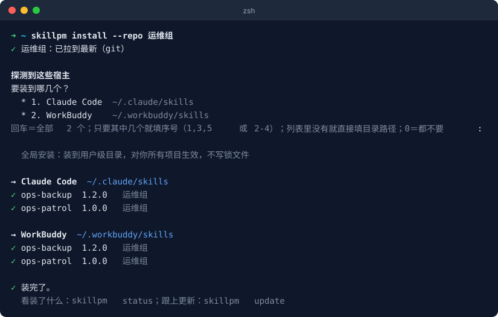
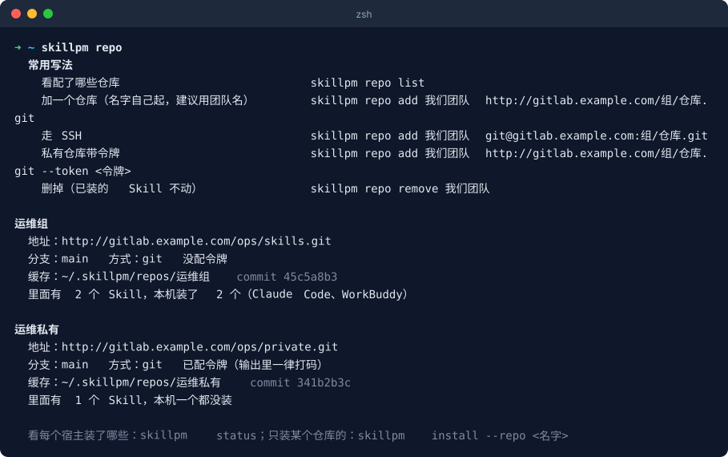
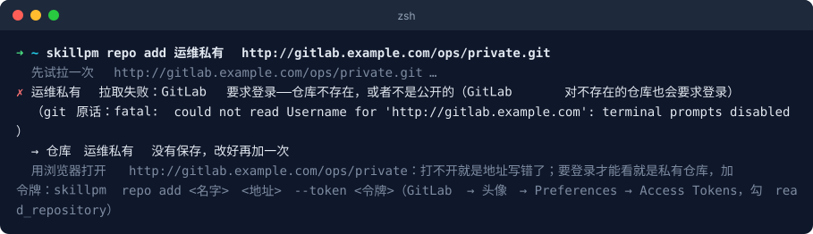
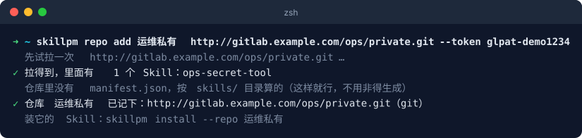
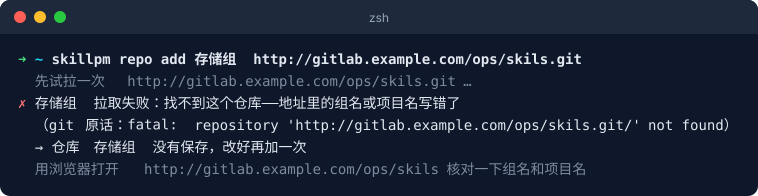

# 接入自己的 Skill 仓库

> 给其他团队：想用 skillpm 装、更新**你们自己的** Skill，照这篇做。
> 下面的 `gitlab.example.com/组/仓库` 都换成你们自己的地址。
> 截图都是真实运行的输出；其中 `gitlab.example.com/ops/…` 是录截图时搭的演示仓库（「运维组」），不是真实地址。

分两个角色：

- **维护仓库的人**（一次性）：把仓库整理成 skillpm 认得的样子 → 第一步（第二步可选）
- **用 Skill 的人**（每人一次）：把仓库加进自己的 skillpm → 第三步

---

## 第一步：仓库长这样

Skill 用的是通用的 Agent Skill 格式，**现成的 Skill 直接放进 `skills/` 就能装**：

```
你们的仓库/
└── skills/                     ← 固定叫这个名字
    ├── 某个-skill/             ← 一个 Skill 一个目录，目录名就是 Skill 名
    │   ├── SKILL.md            ← 必须有
    │   ├── CHANGELOG.md        ← 建议有
    │   ├── references/         ← 可选：参考资料，SKILL.md 里用到时再读
    │   ├── scripts/            ← 可选：要执行的脚本
    │   └── assets/             ← 可选：模板、图片等素材
    └── 另一个-skill/
        └── SKILL.md
```

目录里的所有文件都会原样装过去。

### SKILL.md 格式

```markdown
---
name: 某个-skill
description: 一句话说清楚干什么、什么时候该用它（Agent 靠这句决定要不要用）
version: 1.0.0
---

# 某个 Skill

正文：给 Agent 看的操作说明、步骤、注意事项……
```

| 字段 | 要不要写 | 说明 |
|---|---|---|
| `name` | **必须** | 和目录名一模一样 |
| `description` | **必须**（不写只提醒） | Agent 靠它判断什么时候用这个 Skill，写清「干什么 + 什么时候用」 |
| `version` | 建议 | 写了：更新时能看到「1.0.0 → 1.1.0」和更新日志。**不写也能装**：按文件内容判断有没有更新，版本显示成「未标版本-xxxxxxx」 |

`version` 放在顶层或 `metadata:` 下面都认。

### CHANGELOG.md 格式（建议）

每次改版本加一节，标题写版本号，最新的在最上面。别人 `skillpm update` 时会把这中间的几节念给他看：

```markdown
## 1.0.1 — 2026-09-21
- 修了 xxx

## 1.0.0 — 2026-09-01
- 初版
```

**就这些，不需要别的配置文件。** 以后改了 Skill：改一下 `version`、写一节 `CHANGELOG`，推上去，别人 `skillpm update` 就能看到。

## 第二步（可选）：自检

在仓库根目录跑一下，看别人能不能装：

```bash
skillpm manifest --check
```

`name` 和目录名对不上、没有 frontmatter → 报出来是哪个、怎么改，退出码 1（可以放进 CI）；
没写 `version`、`description`、缺 `CHANGELOG.md` 只提醒。比如 `ops-report` 目录里 `name` 写成了别的：



照提示把 `name` 改成和目录名一样，再检一次：



> 关于 `manifest.json`：它是**可选的**。仓库里没有，skillpm 装的时候直接按 `skills/` 当场算；
> 有的话就用它。**建议不要提交**——提交了就得每次改完都重新生成（`skillpm manifest`），
> 忘了的话别人看到的是旧版本号。有自己发版流程、想在发布时再把一道关的仓库，才值得保留它。

**仓库权限**：最省事是开**匿名读**（GitLab → 项目设置 → 可见性 → 公开/内部），这样大家不用配 SSH key、不用令牌。
不方便公开的，见下面「私有仓库」。

## 第三步：每个人把仓库加进来

```bash
skillpm repo add 我们团队 http://gitlab.example.com/组/仓库.git
```

`我们团队` 是**你给这个仓库起的名字**，不是固定写法——建议就用团队名，比如 `运维组`、`存储组`。
以后 `--repo 运维组` 就是指这个仓库。地址直接写，`http(s)://` 和 `git@` 两种都认。
加的时候会**先试拉一次**，能装才记下来：



然后装：

```bash
skillpm install --repo 我们团队         # 把你们仓库里的 Skill 装上（只问装到哪）
skillpm update                          # 以后更新（所有仓库一起）
```



配了哪些仓库、各有几个 Skill、本机装了几个：`skillpm repo`



### 第一次用 skillpm 的人

装完工具，第一次跑 `skillpm install` 会先问仓库地址，填你们的：

```
1/2　Skill 仓库
  仓库地址: http://gitlab.example.com/ops/skills.git
  给它起个名字，以后 --repo 用它指这个仓库（建议用团队名）
  仓库名 [ops]:                              ← 默认取地址里的组名，回车就行
  先试拉一次 http://gitlab.example.com/ops/skills.git …
✓ 拉得到，里面有 2 个 Skill：某个-skill、另一个-skill

2/2　装到哪
  ……
```

拉不到会说清楚原因、让你重填地址；是私有仓库的话会问你要访问令牌（直接回车＝重填地址）。
已经配了别的仓库也没关系，`repo add` 再加一个，几个仓库可以同时用。

### 私有仓库

两种任选：

```bash
# ① 用令牌（GitLab → 头像 → Preferences → Access Tokens，勾 read_repository）
skillpm repo add 我们团队 http://gitlab.example.com/组/仓库.git --token <令牌>

# ② 用 SSH（要先把自己的 SSH key 加到 GitLab）
skillpm repo add 我们团队 git@gitlab.example.com:组/仓库.git
```

不带令牌加私有仓库，会告诉你要登录：



带上 `--token` 就行：



令牌只存在 `~/.skillpm/config.json`（权限 600），屏幕输出和报错里一律打码；拉代码时也不会写进缓存目录的 git 配置。

### 不是 main 分支

```bash
skillpm repo add 我们团队 http://gitlab.example.com/组/仓库.git --branch dev
```

### 和别的仓库有同名的 Skill

同一个 Agent 下同名的只能留一个。两条规则：

1. **换来源只发生在你自己 `install` 的时候，而且一定先问你**，默认不换；`--force` 直接换。
2. **`update` 永远不换来源**：每个 Skill 只跟它装的时候的那个仓库比，别的仓库里有没有同名的都不影响。

所以起 Skill 名字时尽量带上团队或业务前缀（比如 `ops-巡检`），能从根上避免撞名。

---

## 加不上的时候

`repo add` 失败**不会保存**，改好再加一次就行。报错会说是哪种原因、下一步怎么做，比如项目名写错了：



所有原因：

| 报错里写的 | 怎么办 |
|---|---|
| GitLab 要求登录——仓库不存在，或者不是公开的 | 先用浏览器打开地址看看：打不开就是地址错；要登录才能看就是私有，加 `--token` |
| 找不到这个仓库 | 组名、项目名写错了 |
| 连不上主机 | 主机名写错，或者不在公司网络里 |
| 端口不对 / 被代理截走了 | 端口要和浏览器里打开 GitLab 时的一样；本机开了代理的话，内部地址设成不走代理 |
| SSH 认证没过 | SSH key 没加到 GitLab；不想折腾就改用 http 地址 |
| 仓库里没有这个分支 | `--branch` 指定 |
| 没找到能装的 Skill | 仓库里要有 `skills/<名字>/SKILL.md`，开头 frontmatter 写 `name`（和目录名一样）和 `description`；维护的人跑 `skillpm manifest --check` 看具体哪里不对 |

## 常用命令速查

| 想干什么 | 命令 |
|---|---|
| 看配了哪些仓库 | `skillpm repo` 或 `skillpm repo list` |
| 加仓库 | `skillpm repo add <名字> <地址>` |
| 删仓库（已装的 Skill 不动） | `skillpm repo remove <名字>` |
| 只装某个仓库的 | `skillpm install --repo <名字>` |
| 看有没有新版本 | `skillpm check` |
| 更新 | `skillpm update` |
| 检查仓库合不合格（维护者用） | `skillpm manifest --check` |
| 任何命令的完整用法 | `skillpm <命令> -h` |
